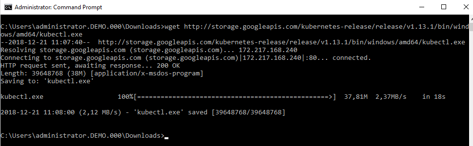
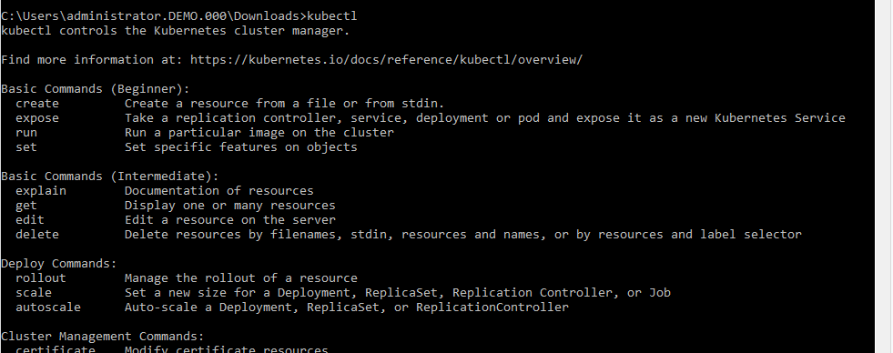
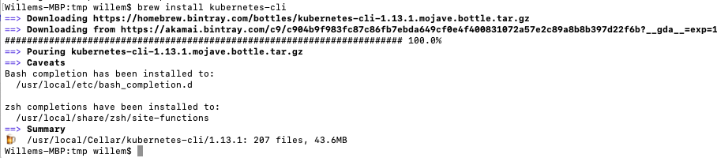
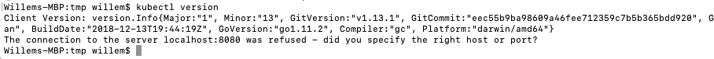
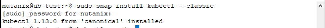
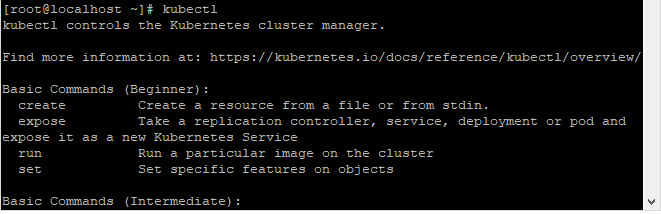

.. _install_kubectl:

----------------
Install: kubectl
----------------

Overview
++++++++

The **kubectl** command will be used to connect to kubernetes cluster(s) so we can manipulate them.

By default *kubectl** is not installed on the machines.

.. note::

  You will need **wget** for Windows and **Homebrew** for MacOS. installs for these are referenced in the **Install wget** lab.

Install kubectl
+++++++++++++++

To get it installed and available use on of the installation "guides" for your Operating System.

Windows
.......

For Windows we can simply download the **.exe** file from the internet.

Use the **wget** command  to "download" the **kubectl.exe** file.

Open a command line on your machine.

Change to the Downloads directory on your machine:

.. code-block:: bash

  cd Downloads

Now download and save the file into the Downloads directory where we are in.

.. code-block:: bash

  wget http://storage.googleapis.com/kubernetes-release/release/v0.16.1/bin/windows/amd64/kubectl.exe

In the command line run **kubectl**. this should show some error messages.

.. code-block:: bash

  kubectl

The **kubectl** command can now be used as long as you are in the Downloads directory.

Mac OS
......

using Homebrew (install now if not), we can use the following command to install kubectl:

.. code-block:: bash

  brew install kubernetes-cli

Run the following to see it has been installed:

.. code-block:: bash

  kubectl version

Your machine is ready to use the **kubectl** command.

Linux
.....

There are different methods to install kubectl per Linux distribution.

For Ubuntu:
-----------

Open a console and run the following command:

.. code-block:: bash

 sudo snap install kubectl --classic

This will install the kubectl package using the snap package manager

Run the following to verify **kubectl** has been installed.

.. code-block:: bash

  kubectl version

	.. image:: images/20.png

The **kubectl** command is ready to be used.

For CentOS
----------

Open a console and run the following command:

.. code-block:: bash
  :name: inline-code

  cat <<EOF > /etc/yum.repos.d/kubernetes.repo
  [kubernetes]
  name=Kubernetes
  baseurl=https://packages.cloud.google.com/yum/repos/kubernetes-el7-x86_64
  enabled=1
  gpgcheck=1
  repo_gpgcheck=1
  gpgkey=https://packages.cloud.google.com/yum/doc/yum-key.gpg https://packages.cloud.google.com/yum/doc/rpm-package-key.gpg
  EOF

  yum install -y kubectl

.. image:: images/21.png

Run the following to verify **kubectl** has been installed.

.. code-block:: bash

  kubectl version

The **kubectl** command is ready to be used.

Software Sources
++++++++++++++++

- https://portal.nutanix.com/#/page/docs/details?targetId=Karbon-v08:Karbon-v08 - Karbon user guide for the URLs of the two images used.
- https://brew.sh - For installing Homebrew on Mac OS.
- https://www.mkyong.com/mac/wget-on-mac-os-x/ - For installing wget on Mac OS.
- https://github.com/kubernetes/kubernetes/issues/41463 - For installing kubectl on Windows. First look at ``https://storage.googleapis.com/kubernetes-release/release/stable.txt`` to get the latest version of the kubectl.exe file. Then create the URL ``http://storage.googleapis.com/kubernetes-release/release/v0.16.1/bin/windows/amd64/kubectl.exe`` where **v0.16.1** in the URL needs to edited to the latest release version.
- https://kubernetes.io/docs/tasks/tools/install-kubectl/ - For installing on Linux distributions.
