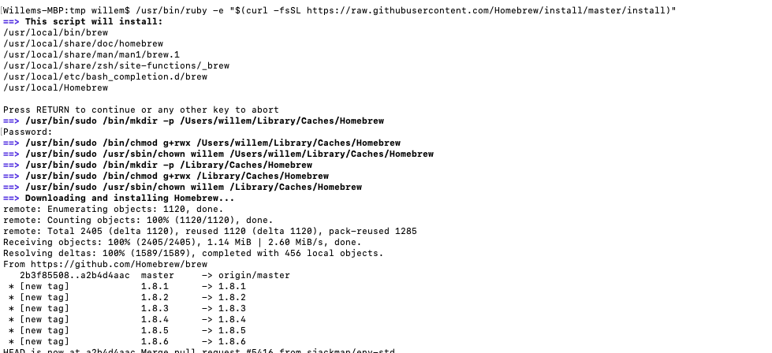
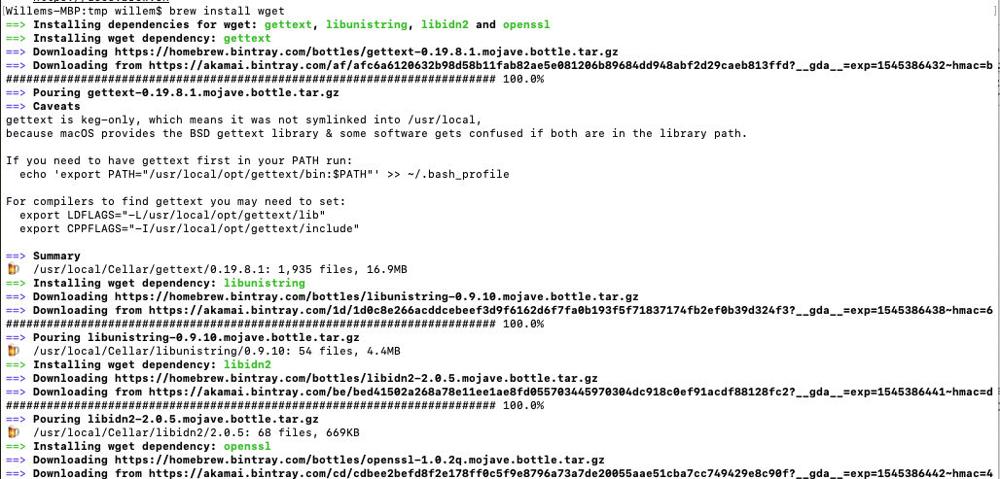
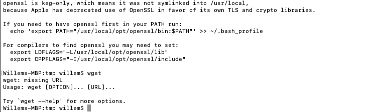

.. _install_wget:

-------------
Install: wget
-------------

Overview
++++++++

During the deployment of an application the **wget** command is used to pull the configuration files for kubernetes.

This lab will you show where to download and install **wget**, if needed.

Install wget
++++++++++++

Please follow the instructions for you Operating System (OS) to install **wget**

Windows
.......

For Windows you can download the wget as a standalone application from http://eternallybored.org/misc/wget. Save the file to a known location. During the modules we kept it in the Downloads folder of the current logged in user.

Mac OS
......

For Mac OS we could use the **curl* command to download files, which is built into the OS.

The following command shows how to download a file with **curl**:

.. code-block:: bash

  curl https://kubernetes.io/examples/application/wordpress/mysql-deployment.yaml -o mysql-deployment.yaml

If you want to use **wget** the installation process is a bit different then on the Windows environment.

To install **wget** follow these steps:

.. note::

  In the below steps we are going to install **wget** using the Homebrew method.

  To use Homebrew you need **Xcode**. Please install that first before you continue.

Open a Terminal session on your Mac

Install **Homebrew** on your Mac using:

.. code-block:: bash

  /usr/bin/ruby -e "$(curl -fsSL https://raw.githubusercontent.com/Homebrew/install/master/install)"

Provide your password if asked for.

Install the **wget** using **Homebrew** by typing:

.. code-block:: bash

  brew install wget

Check that **wget** has been installed by just typing wget. It should provide some error messages

Now you can use the **wget** command to download files, like in the following example:

.. code-block:: bash

  wget https://kubernetes.io/examples/application/wordpress/mysql-deployment.yaml

Linux
.....

**wget** is built into the Operating System. Nothing needs to be done to use **wget**.

Software Sources
++++++++++++++++

- https://brew.sh - For installing Homebrew on Mac OS.
- https://www.mkyong.com/mac/wget-on-mac-os-x/ - For installing wget on Mac OS.
