.. _veeam:

----------------------------------
Veeam Availability for Nutanix AHV
----------------------------------

*The estimated time to complete this lab is 60 minutes.*

Overview
++++++++

With customers that include 82% of the Fortune 500 and 58% of the Global 2000, Veeam is a leader in backup and availability across physical, virtual, and cloud environments. With Veeam Backup & Replication v9.5, Veeam has introduced support for Nutanix AHV through the Backup Proxy for AHV.

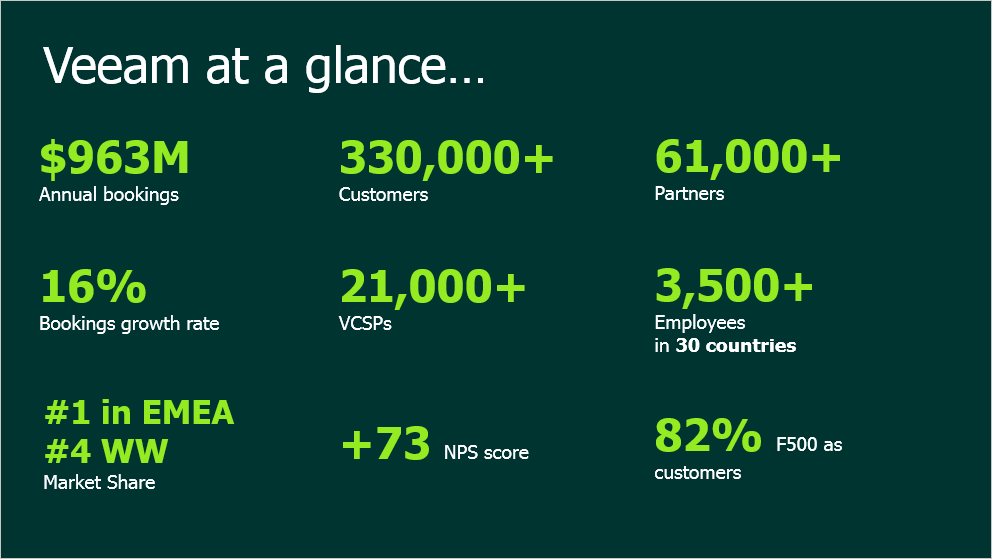

**In this exercise you will deploy and configure a Veeam Backup Server, deploy and configure a Backup Proxy for AHV, configure the connection to your Nutanix cluster and existing Veeam Backup & Replication infrastructure, and execute backup and restore operations.**

Deploying Veeam Backup Server
+++++++++++++++++++++++++++++

The Veeam Backup Server is the main management component in the Veeam backup infrastructure. The Veeam Backup Server is responsible for managing Veeam backup repositories that are used as a target for backup. The Veeam Backup & Replication Console is also used for granular VM restore operations such as restoring individual files, AD objects, Exchange mailboxes, and SQL/Oracle databases.

In **Prism > VM > Table**, click **+ Create VM**.

Fill out the following fields and click **Save**:

- **Name** - *Initials*\ -VeeamServer
- **Description** - Veeam Backup & Replication 9.5 Update 4
- **vCPU(s)** - 4
- **Number of Cores per vCPU** - 1
- **Memory** - 4 GiB
- Select :fa:`pencil` beside **CD-ROM**

  - **Operation** - Clone from Image Service
  - **Image** - VeeamBR-9.5.4.2615.Update4.iso
  - Select **Update**
- Select **+ Add New Disk**

  - **Operation** - Clone from Image Service
  - **Image** - Windows2012
  - Select **Add**
- Select **+ Add New Disk**

  - **Operation** - Allocate on Storage Container
  - **Storage Container** - Default
  - **Size (GiB)** - 250
  - Select **Add**
- Select **Add New NIC**

  - **VLAN Name** - Secondary
  - Select **Add**
- Select **Custom Script**
- Select **Type or Paste Script**

.. literalinclude:: VeeamServer-unattend.xml
   :caption: VeeamServer Unattend.xml Custom Script
   :language: xml

.. note::

 The Unattend script will generate a unique hostname, join the **NTNXLAB.local** domain, and disable the Windows Firewall.

Select the *Initials*\ **-VeeamServer** VM and click **Power on**.

Once the VM has started, connect via RDP or click **Launch Console**.

.. note::

  It is recommended that the VM be accessed via Microsoft RDP, enabling you to copy and paste text from the lab guide into the VM. The Sysprep process will take approximately 2 minutes before the VM can be accessed via RDP.

  **Username** - NTNXLAB\\Administrator
  **Password** - nutanix/4u

Open **PowerShell** and execute the following command:

.. code-block:: Powershell
  :emphasize-lines: 1

  # Initializes and formats the 250GB disk added to the VeeamServer VM
  Get-Disk | Where partitionstyle -eq 'raw' | Initialize-Disk -PartitionStyle MBR -PassThru | New-Partition -AssignDriveLetter -UseMaximumSize | Format-Volume -FileSystem NTFS -NewFileSystemLabel "Backups" -Confirm:$false

Download the temporary Veeam Availability Suite license file from http://10.42.8.50/veeam/ to apply during installation.

Open the **Veeam Backup and Replication 9.5** Setup from the mounted .iso image. Click **Install**.

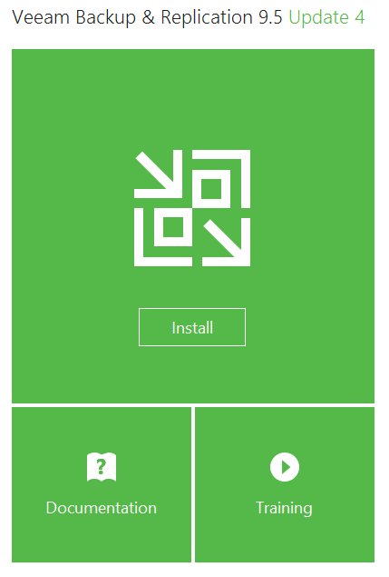

Accept the license agreements and click **Next**.

Click **Browse** and select the downloaded Veeam NFR license file. Click **Next > Next**.

If prompted for missing pre-requisite components, click **Install**. After completion, click **Next**.

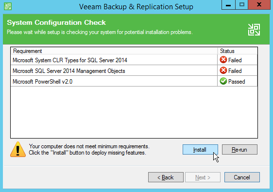

Review the configuration and click **Install**.

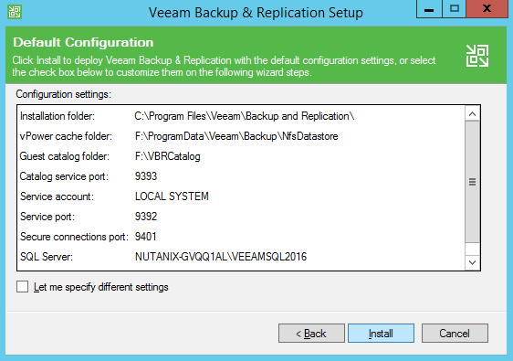

Out of the box installation of Veeam Backup & Replication is fast and simple.

By default the Veeam Backup Server will deploy a Windows SQL Server Express database instance. A production Veeam deployment would use an external, highly available database.

The installer will also create a Veeam Backup Repository to act as a backup target, by default it will select the volume with the most free space exposed to the backup server (the local 250GB disk added to the *Initials*\ **-VeeamServer** VM).

For storing backups of Nutanix AHV VMs, Veeam currently supports the use of simple backup repositories (any Windows-compatible file or block storage), scale-out backup repositories, and ExaGrid appliances. DellEMC Data Domain DD Boost and HPE StoreOnce Catalyst proprietary storage protocols are not currently supported for Veeam Availability for Nutanix, but each of these storage targets can still be used as standard CIFS repositories.

While waiting for installation to complete, proceed to `Deploying Veeam Backup Proxy`_.

Deploying Veeam Backup Proxy
++++++++++++++++++++++++++++

The Backup Proxy is a Linux based virtual appliance that performs the role of a coordinator between the Nutanix platform and Veeam Backup & Replication. The appliance can be installed manually, as in the exercise below, or also launched from a blueprint on the `Calm Global Marketplace <https://www.nutanix.com/products/calm/>`_.

The Backup Proxy communicates with the AHV platform via Nutanix REST API, assigns necessary resources for backup and restore operations, reads/writes data from/to Nutanix storage containers and transports VM data to/from target Veeam backup repositories. The Backup Proxy is also responsible for job management and scheduling, data compression and deduplication, and applying retention policy settings to backup chains.

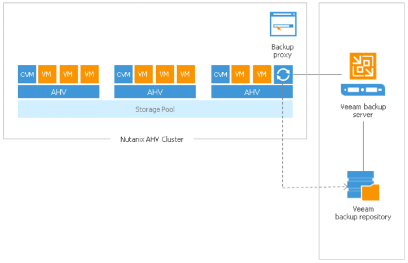

Each Nutanix cluster leveraging Veeam for backup will require its own Backup Proxy VM.

In **Prism > VM > Table**, click **+ Create VM**.

Fill out the following fields and click **Save**:

- **Name** - *Initials*\ -VeeamProxy
- **Description** - Veeam Backup Proxy
- **vCPU(s)** - 2
- **Number of Cores per vCPU** - 2
- **Memory** - 4 GiB
- Select **+ Add New Disk**

  - **Operation** - Clone from Image Service
  - **Image** - VeeamAvailability_1.0.457
  - Select **Add**
- Select **Add New NIC**

  - **VLAN Name** - Secondary
  - Select **Add**

Select the *Initials*\ **-VeeamProxy** VM and click **Power on**.

Base sizing for the proxy appliance is 2 vCPU/2 Cores per vCPU and 4GB of RAM to support a default concurrency of 3 VM backup/restore operations. Each additional concurrent task would require increasing the proxy appliance by 1 core and 1GB of RAM.

Once the VM has started, open \https://<*VeeamProxy-VM-IP*>:8100/ in a browser. Log in using the default credentials:

- **Username** - admin
- **Password** - admin

Click **Install**.

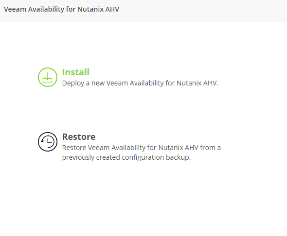

Accept the license agreement and click **Next**.

Fill out the following fields and click **Next** to update the default appliance password:

- **Old Password** - admin
- **New Password** nutanix/4u
- **Confirm New Password** - nutanix/4u

Fill out the following fields and click **Next**:

- **Appliance host name** - *Initials*\ -VeeamProxy
- Select **Obtain an IP address automatically**

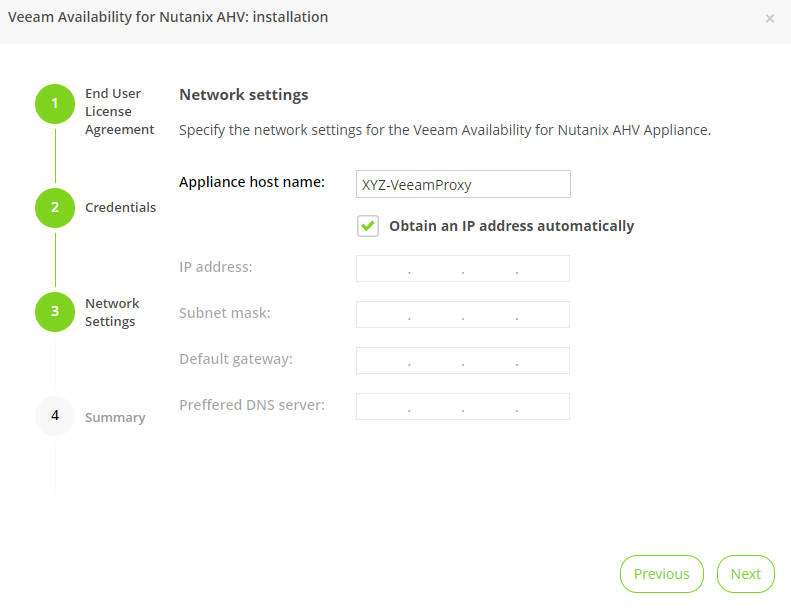

Click **Finish**.

After approximately 1 minute you will be redirected to log in to the **Veeam Backup Proxy Web Console**.

Configuring the Proxy Appliance
+++++++++++++++++++++++++++++++

Log in to the **Veeam Backup Proxy Web Console** using the updated **admin** credentials.

When prompted about the missing license, click **OK**.

.. note::

  For personal lab or HPOC deployments, Veeam licenses can be requested by Nutanix employees and partners by contacting Ronn.Martin@veeam.com.

To license the appliance, click :fa:`cog` **> Appliance Settings > Summary > License** and install the temporary Veeam Nutanix NFS license from http://10.42.8.50/veeam/.

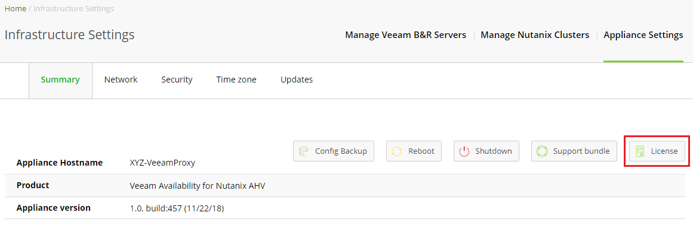

Now that the appliance is licensed, you must configure both the Nutanix cluster source and the Veeam Backup & Replication server that will manage targets and advanced Veeam functionality.

From the toolbar, click :fa:`cog` **> Manage Nutanix Clusters**.

Click **+ Add**, fill out the following fields and click **Add**:

- **Cluster name of IP** - *Nutanix Cluster Virtual IP*
- **Port** - 9440
- **Description** - *Nutanix Cluster Name*
- **User** - admin
- **Password** - nutanix/4u

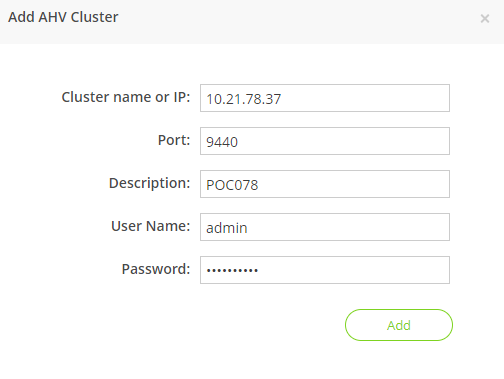

From the toolbar, click :fa:`cog` **> Manage Veeam Servers**.

Click **+ Add**, fill out the following fields and click **Add**:

- **DNS Name or IP** - *Initials-VeeamServer IP*
- **Port** - 10006
- **Description** - *Nutanix Cluster Name* VeeamServer
- **User Name** - Administrator
- **Password** - nutanix/4u

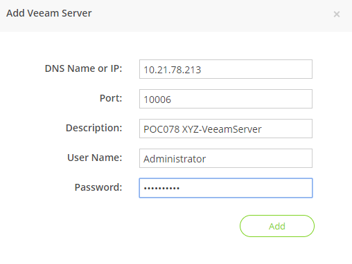

Verify the Veeam B&R server is added successfully.

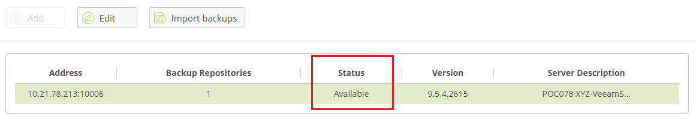

Backing Up A VM
+++++++++++++++

Veeam Backup & Replication backs up Nutanix AHV VMs at the image level, just like VMware vSphere and Microsoft Hyper-V VMs. The Backup Proxy communicates with Nutanix AHV to trigger a VM snapshot, retrieves VM data block by block from Storage Containers hosting VMs, compresses and deduplicates the data, and writes to the Backup Repository in Veeam’s proprietary format.

For AHV VMs, Veeam Backup & Replication utilizes the forever forward incremental backup method. During the initial backup, Veeam  copies the whole content of the VM and creates a full backup file (VBK) in the target location. The full backup file acts as a starting point of the backup chain. During subsequent backup sessions, Veeam copies only those data blocks that have changed since the previous backup, and stores these data blocks to an incremental backup file in the target location. Incremental backup files depend on the full backup file and preceding incremental backup files in the backup chain. The Backup Proxy integrates with Nutanix's Change Block Tracking (CBT) API to determine the changed portion of a VM's data to enable efficient, incremental backups.

In **Prism > VM > Table**, click **+ Create VM**.

Fill out the following fields and click **Save**:

- **Name** - *Initials*\ -VeeamBackupTest
- **Description** - *Initials*\ -VeeamBackupTest
- **vCPU(s)** - 2
- **Number of Cores per vCPU** - 1
- **Memory** - 4 GiB
- Select **+ Add New Disk**

  - **Operation** - Clone from Image Service
  - **Image** - Windows2012
  - Select **Add**
- Select **Add New NIC**

  - **VLAN Name** - Secondary
  - Select **Add**

Select the *Initials*\ **-VeeamBackupTest** VM and click **Power on**.

Once the VM has started, click **Launch Console**.

Complete the Sysprep process and provide a password for the local Administrator account.

Log in as the local Administrator and create multiple files on the desktop (e.g. documents, images, etc.).

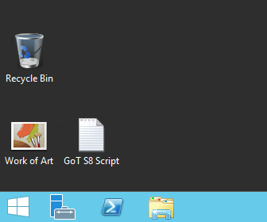

From the **Veeam Backup Proxy Web Console**, select **Backup Jobs** from the toolbar.

Click **+ Add**, provide a name for the backup job (e.g. *Initials*\ -DevVMs), and click **Next**.

Click **+ Add** and search for the VM you created for this exercise. Click **Add > Next**.

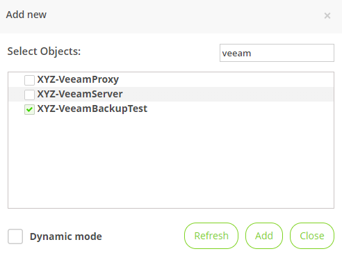

.. note::

  Dynamic Mode allows you to backup all VMs within a Nutanix Protection Domain. This could make configuration of a backup job simpler if you are already taking advantage of Nutanix PDs, it will also ensure any new VMs added to the PD are backed up by Veeam without having to modify the job.

Select **Default Backup Repository** and click **Next**. This is the 250GB disk attached to the *Initials*\ **-VeeamServer** VM, but other supported Veeam backup repositories could be selected if available in the environment.

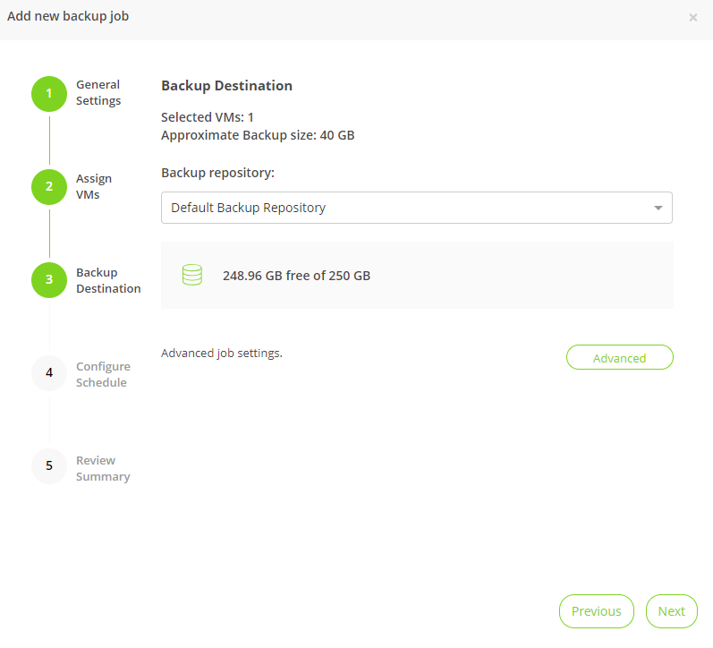

Fill out the following fields and click **Next**:

- Select **Run this job automatically**
- Select **Periodically every:**
- Select **1**
- Select **Hour**
- **Restore Points to keep on disk** - 5

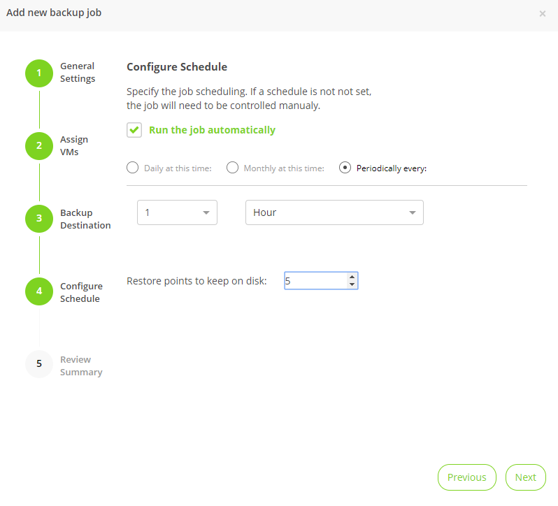

Select **Run backup job when I click Finish** and click **Finish**.

Monitor the progress of until the initial full backup completes successfully. The initial backup should take approximately 2-5 minutes. Click **Close**.

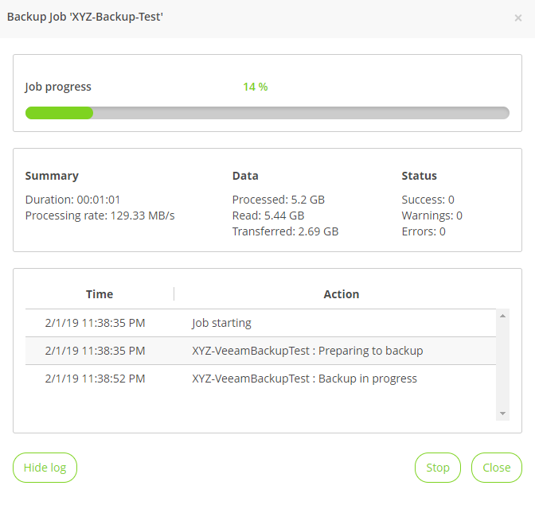

.. note::

  You can click **Close** without interrupting the backup job. To view job progress again click the **Running** link under **Status** of the backup job.

Return to your *Initials*\ **-VeeamBackupTest** VM console and make some small changes (e.g. downloading wallpaper images from the Internet, installing an application, etc.)

From the **Veeam Backup Proxy Web Console > Backup Jobs**, select your job and click **Start** to manually trigger an incremental backup to add to the backup chain.

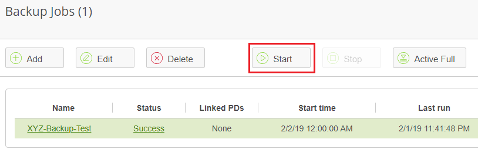

The second backup job should complete in under 1 minute as there should be minimal delta between the original full backup and the new incremental backup. Note that the full capacity of the VM's disk was processed (40GB), but due to the Change Block Tracking API, only a small amount of data was actually read and transferred to the backup repository. This was also accomplished without having to "stun" the VM to perform a hypervisor level snapshot.

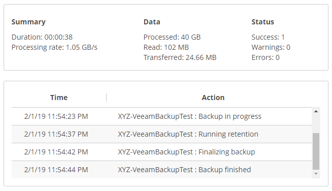

.. note::

  Administrators also have the ability to manually trigger a new, full backup of VMs by selecting a job and clicking **Active Full**. This new full backup would reset the backup chain, and all subsequent incremental backups would use it as a starting point. The previous full backup will remain in the repository until it is removed from the backup chain based on configured retention.

Return to the **Dashboard** for a high level overview of the most critical backup metrics for the cluster. While Veeam Backup & Recovery offers a solution for managing backups across a large environment, the AHV Backup Proxy provides a streamlined, HTML5 UI for Nutanix administrators to control their backups and identify key issues that could impact data protection.

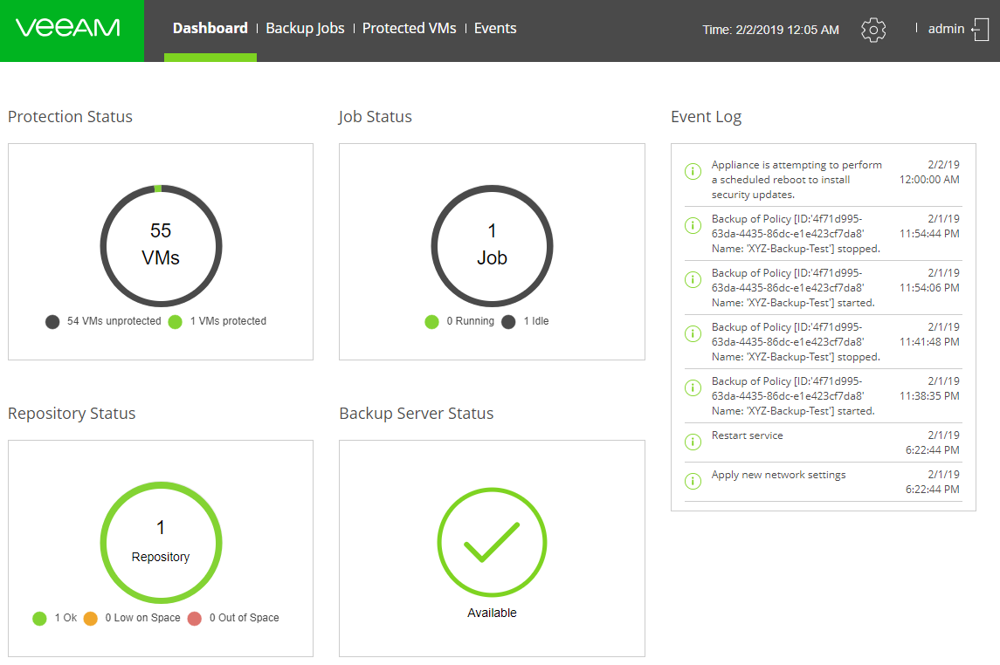

Restoring A VM
++++++++++++++

Using the Backup Proxy Web Console, you can restore a VM from backup to the Nutanix AHV cluster. At present, Veeam Backup & Replication does not support restoring from one Nutanix cluster to another. During the restore process, the Backup Proxy retrieves VM disk data from the backup on the Veeam Backup Repository, copies it to the Storage Container where disks of the original VM were located, and registers a restored VM on the Nutanix AHV cluster.

From the **Veeam Back Proxy Web Console**, select **Protected VMs** from the toolbar.

Select your previously created backup job and click **Restore**.

Using the **Add**, **Remove**, and **Point** options, you can selectively restore only the desired VM(s) to a specific time. By default, all VMs within the backup job will be restored based on the most recent backup.

Click **Next**.

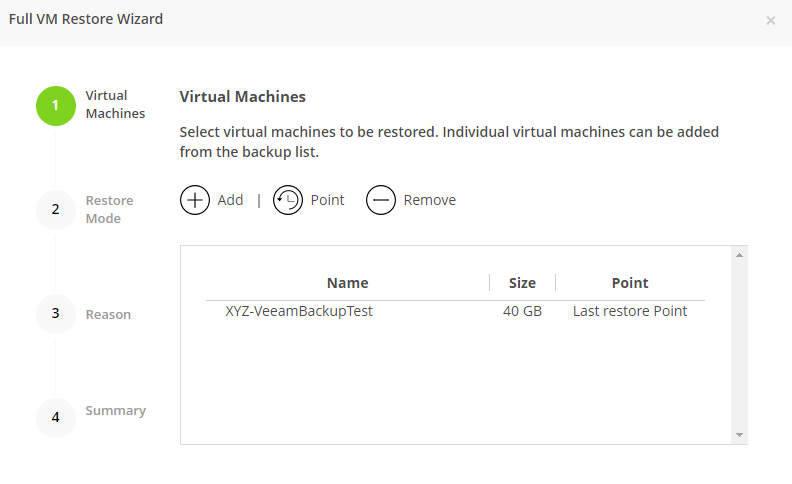

Select **Restore to a new location** and click **Next** to clone the VM from backup data rather than overwriting the existing VM.

Select *Initials*\ **-VeeamBackupTest** and click **Rename VM**. Select **Add suffix** and click **OK > Next**:

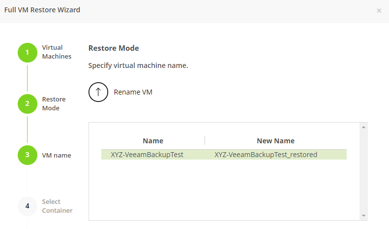

If desired, you can expand the VM and redirect the restored VM to an alternate Nutanix storage container. By default, the VM will be restored to its original storage container.

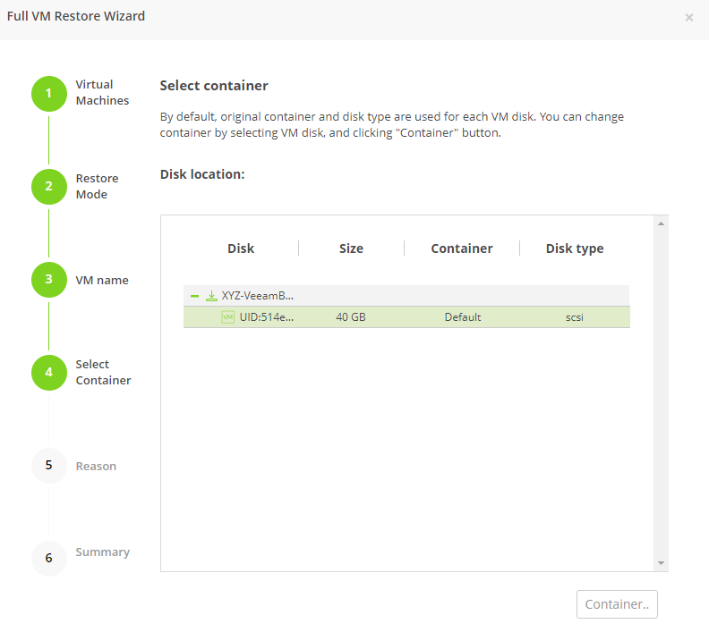

Click **Next**.

Specify a reason for the restore operation and click **Next**.

Click **Finish** and monitor the restore operation until successfully completed.

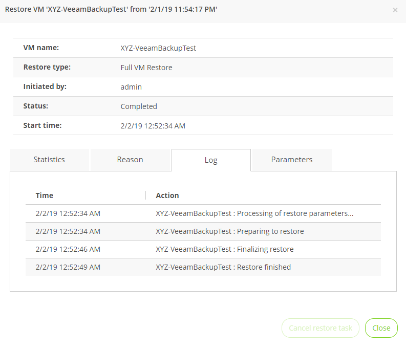

.. note::

  If the most recent restore point is selected, the restore operation will complete very rapidly. Veeam will retain the most recent, rolling snapshot of each VM and can restore directly from the local snapshot rather than the backup target storage.

Power on the restored VM in Prism and verify it reflects the latest manual backup.

**Congratulations!** From a single web console you were able to manage and monitor your Veeam backup operations for your Nutanix cluster.

In addition to full VM restores, the **Veeam Backup Proxy Web Console** can also restore individual virtual disks which can be mapped to any VM within the cluster. This functionality can be helpful if virtual disks containing data become corrupted (e.g. cryptolocker, virus, etc.).

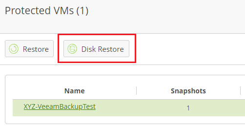

Try restoring your backup test VM disk directly to your Windows Tools VM!

File Level Restore and More
+++++++++++++++++++++++++++

While the **Veeam Backup Proxy Web Console** delivers all of the basic data protection functionality required by an infrastructure administrator, additional advanced functionality can be accessed on the **Veeam Backup Server** using the **Veeam Backup & Replication Console**.

A common use case for restoring data is accessing individual files within a guest that have been inadvertently changed or deleted. Eliminating the need to provision an entire VM to access a single file can significantly decrease the time and resources required.

From the *Initials*\ **-VeeamServer** console (or RDP session), open **Veeam Backup & Replication Console**.

From the **Home** tab, select **Restore > Nutanix AHV**.

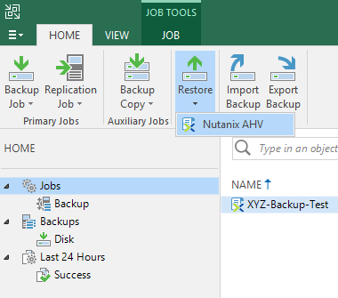

Click **Guest files restore > Microsoft Windows**.

Under your AHV backup job, select your VM and click **Next**.

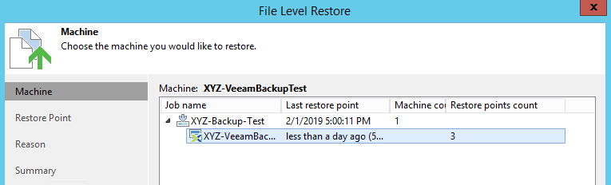

Select the most recent Restore Point and click **Next**.

Specify a reason for the restore operation (e.g. "Testing file restore") and click **Next > Finish**.

Veeam will virtually mount the VM disks associated with the backup and display them in the **Backup Browser** app.

.. note::

  You can also explore the file level restore mount locally on the *Initials*\ **-VeeamServer** under ``C:\VeeamFLR``.

Navigate to and select a file you wish to extract. Clicking **Copy To** will allow you to export a copy of the file locally or to a file share.

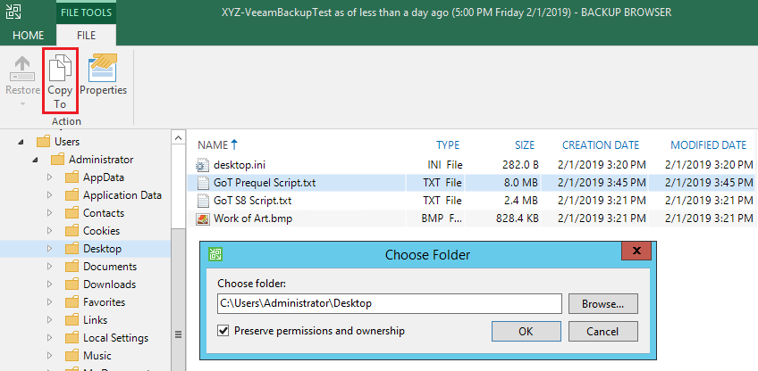

Close the **Backup Browser** to unmount the backup.

The **Backup Browser** can also be used in conjunction with the **Veeam Explorer** applications to perform application aware restores for Microsoft Active Directory, Exchange, SharePoint, SQL Server, and Oracle workloads.

-------------------------------------------------------------------------

Optionally, if you have access to an AWS or Azure account, Veeam can be leveraged to restore an AHV VM backup *directly to the public cloud*, including the ability to configure region, instance type, VPC, and security policy.

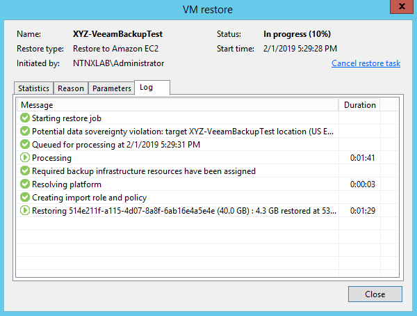

This feature can address a number of use cases including DR and and cloud migration.

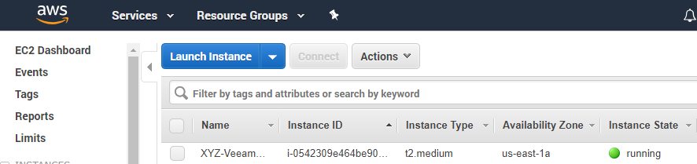

-------------------------------------------------------------------------

Once AHV VM backups are stored in the Veeam Backup Repository, Veeam offers backup copy functionality to create multiple instances of the same backup data in different locations.

Like primary backups configured through the AHV Backup Proxy, backup copy is a job-driven process. Veeam Backup & Replication fully automates the backup copy process and lets you specify retention settings to maintain the desired number of restore points, as well as full backups for archival purposes.

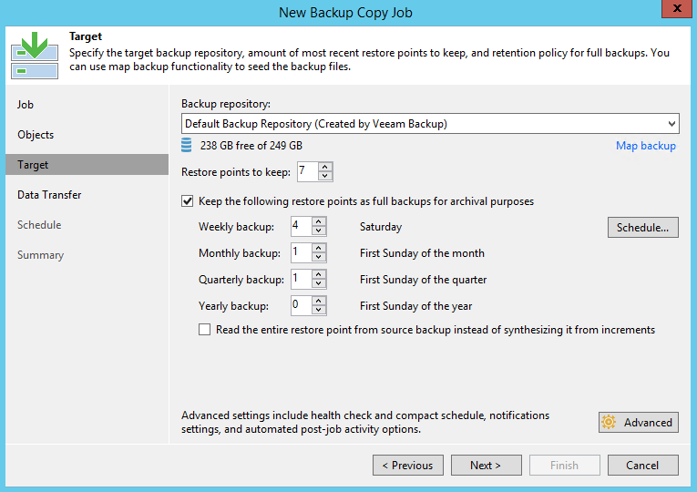

Backup copy makes it simple to follow the "3-2-1" rule recommended by backup experts:

- **3** - You must have at least three copies of your data: the original production data and two backups.

- **2** - You must use at least two different types of media to store the copies of your data (e.g. local disk and tape/cloud).

- **1** - You must keep at least one backup offsite (in the cloud or in a remote site).

Takeaways
+++++++++

What are the key things you should know about **Veeam** and the **Backup Proxy for AHV**?

- Veeam is a widely adopted backup technology that features native support for Nutanix AHV.

- The Veeam Backup Proxy for AHV provides a standalone HTML5 UI for Nutanix administrators to quickly perform backup and restore operations without access to the Veeam Backup & Replication Console.

- Veeam provides agentless VM backup, integrating directly with Nutanix snapshots via API.

- Veeam has advanced restore capabilities including support for file level restore, Microsoft Active Directory, Microsoft Exchange, Microsoft SQL Server, and Oracle.
